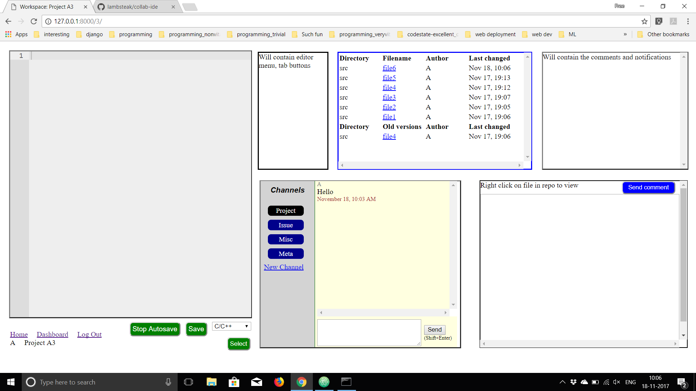

# collab-ide
### Currently implemented features:
- text editor
- chatroom
- repo view
- real-time file viewing as it is being written by another project member

### Features planned to be implemented next:
- terminal to test the codes
- multiple tabs for file writing and viewing
- voice chat and screen-casting for team discussions
- real-time commenting on another team member's work, right in a position in the file they are working on

*collab-ide* is an online real-time collaborative IDE for teams to work together on a fast-paced project. It is especially suited for scenarios like *collaboratively solving problems in a competitive coding event*, or other such cases where very fast-paced and generally short-lived team effort takes place.  

Our ultimate aim is to build an IDE where a programmer does not need to leave her/his screen (ide) for any task while working on her/his project. This means an embedded terminal to test the codes, an embedded repo window to traverse and scan through the whole work of the team, the ability to *see quickly , in live time what is the current status of a file being worked on by someone else while they are writing in it* in order to facilitate a lively and fast-paced collaboration and interaction to fasten the development and make it more efficient. collab-ide also aims to provide a solid embedded chatroom, full with features like creating new channels and direct PM etc to let developers quickly discuss about things without having to leave their ide screen. And lastly, of course an IDE also must have a text editor, which we are trying to make more powerful.

And yes, our goal (at least now) is to provide all of this in one single view on screen without any need to scroll or click buttons to access these features (or very few clicks, depending on your needs and configurations).
Here's a screenshot:

The project is a normal Django application and can be tested locally by cd-ing into the project repo and running `python manage.py runserver` assuming Django is installed (look into *CONTRIBUTING.md* for more details about setting up the project).
### A live instance of this project is running at <http://lambsteaklab.pythonanywhere.com>
